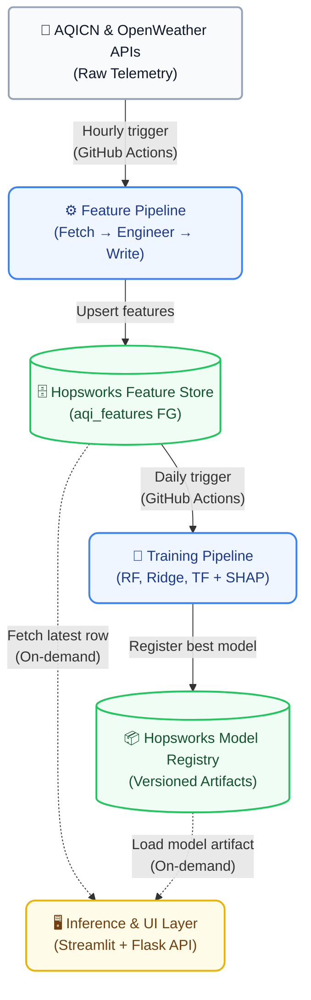

# Pearls AQI Predictor

A 100% serverless, end-to-end machine learning system that forecasts a city's Air Quality Index (AQI) for the **next 3 days** (24h, 48h, 72h horizons). 

Built with Hopsworks Feature Store, GitHub Actions scheduled pipelines, Scikit-learn, TensorFlow, Flask API, and an interactive Streamlit dashboard.

---

## 🏛️ System Architecture



---

## 🖥️ Enterprise Dashboard Architecture

The application delivers an enterprise-grade visualization layer designed for executive presentation and real-time monitoring.

- **Dynamic Visuals:** Mathematical SVG circular gauge with responsive color-shifting based on standard AQI categories (Good, Moderate, Sensitive, Unhealthy).
- **Trend Analysis:** EPA color-coded 24-hour diurnal trend line and comprehensive exploratory data analysis (EDA) charts.
- **Live Telemetry:** Matrix of primary pollutants (PM2.5, PM10, NO₂, O₃) with real-time readings.
- **Explainable AI:** Interactive SHAP feature importance rankings that explain exactly *why* the model predicts specific AQI values.
- **Model Benchmarking:** Interactive metrics (R² Parity Fit, MAE Horizon Bars, RMSE Residual Distribution) evaluating the active Random Forest, Ridge, and TensorFlow models.
- **Health Advisories:** Automated generation of WHO & EPA aligned public health advisories based on the forecasted horizon.

---

## 🚀 Quick Start

### 1. Installation & Environment Setup

```bash
# Clone the repository
git clone https://github.com/your-username/pearls-aqi-predictor.git
cd pearls-aqi-predictor

# Create and activate virtual environment
python -m venv venv
# On Windows:
.\venv\Scripts\activate
# On Linux/macOS:
source venv/bin/activate

# Install dependencies
pip install -r requirements.txt
```

### 2. Configure Environment Variables

Copy `.env.example` to `.env` and provide your API keys:

```env
AQICN_API_KEY=your_aqicn_token
OPENWEATHER_API_KEY=your_openweather_key
HOPSWORKS_API_KEY=your_hopsworks_api_key
HOPSWORKS_PROJECT_NAME=your_hopsworks_project
FLASK_API_URL=http://127.0.0.1:5000
```

- **AQICN Token:** [https://aqicn.org/data-platform/token/](https://aqicn.org/data-platform/token/)
- **OpenWeather Key:** [https://openweathermap.org/api](https://openweathermap.org/api)
- **Hopsworks Account:** [https://hopsworks.ai/](https://hopsworks.ai/)

---

## 🏃 Running the MLOps Pipelines

The machine learning pipelines can be executed standalone from the root directory:

```bash
# 1. Historical Backfill (generate and store historical feature data)
python -m src.backfill.run_backfill --days 60

# 2. Hourly Feature Pipeline (fetch live pollutants & weather, store features)
python -m src.feature_pipeline.run_feature_pipeline

# 3. Daily Training Pipeline (train Ridge, RF, TF models, evaluate, and register)
python -m src.training_pipeline.run_training_pipeline
```

---

## 🌐 Serving & Dashboards

### Option A: Local Development
Start the Flask API on port 5000:
```bash
python -m src.inference.api
```
In a separate terminal, start the Streamlit Dashboard:
```bash
streamlit run src/dashboard/app.py
```

### Option B: Cloud Deployment (Serverless)
1. **API Deployment:** Use the provided `Dockerfile` to deploy the Flask API to Hugging Face Spaces, Render, or Railway.
2. **Dashboard Deployment:** Update `FLASK_API_URL` in your configuration to point to your new cloud API, then deploy the Streamlit app to Streamlit Community Cloud.

---

## 🧪 Testing

Run the unit and integration test suites:
```bash
pytest
```
Tests comprehensively cover feature engineering, API client retry logic, model evaluation, and inference alerts.
